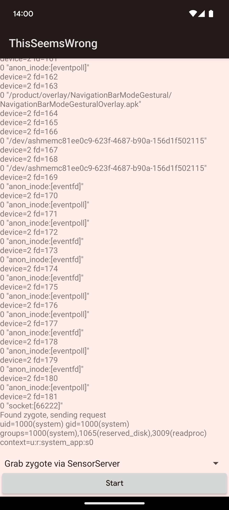

Fix for this issue appeared as CVE-2024-49746: [bulletin](https://source.android.com/docs/security/bulletin/2025-02-01#framework), [patch](https://android.googlesource.com/platform/frameworks/native/+/b3cdb06ab9137a67e4ee212ae6655de383fdaaaa%5E%21/)

# "This seems wrong"

Above title is the comment from [`Parcel::continueWrite` method](https://cs.android.com/android/platform/superproject/main/+/main:frameworks/native/libs/binder/Parcel.cpp;l=3029-3132;drc=f4c9b48c19f1b040efb35932b322f47e7779cafe), which is actually responsible for resizing `Parcel` objects, either when explicitly request by user (for example through [`setDataSize()`](https://developer.android.com/reference/android/os/Parcel#setDataSize(int))) or when calling one of `write` methods when current data capacity is too small

```cpp
status_t Parcel::continueWrite(size_t desired)
{
    // SNIP: Validate desired size
    // SNIP: Assign kernelFields & rpcFields from variant member of this class
    // SNIP: Count number of objects (Binder handles and File Descriptors)
    //       that will be present after resize and assign to objectsSize

    if (mOwner) {
        // If the size is going to zero, just release the owner's data.
        if (desired == 0) {
            freeData();
            return NO_ERROR;
        }

        // If there is a different owner, we need to take
        // posession.
        uint8_t* data = (uint8_t*)malloc(desired);
        // SNIP: Check if malloc succeeded
        binder_size_t* objects = nullptr;

        if (kernelFields && objectsSize) {
            objects = (binder_size_t*)calloc(objectsSize, sizeof(binder_size_t));
            // SNIP: Check if calloc succeeded

            // Little hack to only acquire references on objects
            // we will be keeping.
            size_t oldObjectsSize = kernelFields->mObjectsSize;
            kernelFields->mObjectsSize = objectsSize;
            acquireObjects();
            kernelFields->mObjectsSize = oldObjectsSize;
        }
        // SNIP: rpcFields handling for non-/dev/binder Parcels

        if (mData) {
            memcpy(data, mData, mDataSize < desired ? mDataSize : desired);
        }
        if (objects && kernelFields && kernelFields->mObjects) {
            memcpy(objects, kernelFields->mObjects, objectsSize * sizeof(binder_size_t));
        }
        // ALOGI("Freeing data ref of %p (pid=%d)", this, getpid());
        if (kernelFields) {
            // TODO(b/239222407): This seems wrong. We should only free FDs when
            // they are in a truncated section of the parcel.
            closeFileDescriptors();
        }
        mOwner(mData, mDataSize, kernelFields ? kernelFields->mObjects : nullptr,
               kernelFields ? kernelFields->mObjectsSize : 0);
        mOwner = nullptr;

        // SNIP: Allocation count tracking
        // SNIP: Assign data and objects to this object
    } else if (mData) {
        // SNIP: Resize data owned by this instance of Parcel
    } else {
        // SNIP: Allocate initial data for currently empty Parcel
    }

    return NO_ERROR;
}
```

[When that comment was introduced](https://android.googlesource.com/platform/frameworks/native/+/53b6ffe5af3951e8784c451ef8c4ff19f3d6b196%5E!/), `closeFileDescriptors()` call was moved from `IPCThreadState::freeBuffer()` (which is called in above code through `mOwner()` function pointer) to `continueWrite()` method, however logic was same as before. After all, `Parcel` is core part of Android IPC and if core IPC was closing File Descriptors it shouldn't it'd be obvious problem

Which brings us to important part: when above code is being used? It is used when Parcel class moves ownership of data received from Binder driver (which at that point reside in [`/dev/binder` `mmap`](https://cs.android.com/android/platform/superproject/main/+/main:frameworks/native/libs/binder/ProcessState.cpp;l=587-592;drc=187efe18e3de6258af0230198c881915cc695567) and cannot be written to (any attempts to write that memory would lead to `SIGSEGV`)), that is `Parcel` being either incoming transaction data (`data` argument passed to [`onTransact()`](https://developer.android.com/reference/android/os/Binder#onTransact(int,%20android.os.Parcel,%20android.os.Parcel,%20int))) or incoming reply (that is, `Parcel` object that was passed to [`transact()`](https://developer.android.com/reference/android/os/IBinder#transact(int,%20android.os.Parcel,%20android.os.Parcel,%20int)) call as `reply` argument, `transact()` sets reference within that `Parcel` object)

In practice, only case we'd enter `if (mOwner)` block is when system [calls `setDataSize(0)` to release transaction data](https://cs.android.com/android/platform/superproject/main/+/main:frameworks/native/libs/binder/IPCThreadState.cpp;l=1483-1488;drc=187efe18e3de6258af0230198c881915cc695567), but in that case we'd also enter `if (desired == 0)` which does early return. During legitimate system usage there's no case where we'd enter "If there is a different owner, we need to take possession" path though

# Triggering the "take possession" path

In one of my previous exploits I've shown [case where `createFromParcel()` can actually call `writeInt(0)` on `Parcel` it should be reading from](https://github.com/michalbednarski/TheLastBundleMismatch#side-effects). While fix there prevented execution of any non-`Intent` `createFromParcel()` methods within `AccountManagerService`, the `createFromParcel()` to `writeInt(0)` path was kept intact

To recap, [inside `PackageParser` we have following code](https://cs.android.com/android/platform/superproject/main/+/main:frameworks/base/core/java/android/content/pm/PackageParser.java;l=7789-7795;drc=7d3ffbae618e9e728644a96647ed709bf39ae759):

```java
final Class<T> cls = (Class<T>) Class.forName(componentName);
final Constructor<T> cons = cls.getConstructor(Parcel.class);

intentsList = new ArrayList<>(N);
for (int i = 0; i < N; ++i) {
    intentsList.add(cons.newInstance(in));
}
```

Therefore, we can have `Parcel` object which was passed to `createFromParcel` passed to any available in system `public` constructor that accepts single `Parcel` argument

And elsewhere [we have following code](https://cs.android.com/android/platform/superproject/main/+/main:frameworks/base/core/java/android/os/PooledStringWriter.java;l=51-56;drc=782d49826862cbdc9d020fc9d85f8a6f64675dcb):

```java
public PooledStringWriter(Parcel out) {
    mOut = out;
    mPool = new HashMap<>();
    mStart = out.dataPosition();
    out.writeInt(0); // reserve space for final pool size.
}
```

Therefore, in order to trigger "take possession" path, we need to have arbitrary `readParcelable` call on `Parcel` that was passed to `onTransact()` as `data`, in this exploit I'm using for that [same path I previously used in different one](https://github.com/michalbednarski/LeakValue#putting-parcelables-in-system_server-and-retrieving-them). I have `readParcelable` call `PackageParser$Activity.CREATOR.createFromParcel()`, which in turn reads `PooledStringWriter` name and calls its constructor and after that `Parcel` data ends, so `writeInt()` needs to reallocate Parcel, entering our "take possession" path

Of note here, if there wasn't end of `Parcel` data at that point, `writeInt()` would attempt overwriting data in place, which in case of data backed by `/dev/binder` `mmap` would lead to `SIGSEGV`

# File Descriptor Sanitizer

My initial idea was to have "take possession" path close File Descriptors, after which at end of transaction same Descriptors would be closed again, but between those things happen I'd put other File Descriptor within `system_server` in another transaction and at later point get my File Descriptor back, as that FD refers at that point to different file

That has worked on my emulator using old AOSP version, however once I tried with more recent version that plan was stopped by [File Descriptor Sanitizer (FDSan)](https://android.googlesource.com/platform/bionic/+/refs/heads/main/docs/fdsan.md)

In particular, [in `android-14.0.0_r29` FDSan coverage was extended to cover FDs within `Parcel`](https://android.googlesource.com/platform/frameworks/native/+/7772039cc5084247450f6113d9a18eca17f672aa%5E!/)

In fact, after FDSan covered Parcel, I weren't even able to reach `closeFileDescriptors()` call when `Parcel` has contained FDs. Before that call, there is call to `acquireObjects();`, which in acquires references to `Binder` handles (which are released by `mOwner()` call later within that function), however `acquireObjects()` will also [set FDSan tags for FDs](https://cs.android.com/android/platform/superproject/main/+/main:frameworks/native/libs/binder/Parcel.cpp;l=175-178;drc=f4c9b48c19f1b040efb35932b322f47e7779cafe):

```cpp
case BINDER_TYPE_FD:
    if (obj.cookie != 0) { // owned
        FdTag(obj.handle, nullptr, who);
    }
```

The thing is that we [already tagged FDs received from kernel](https://cs.android.com/android/platform/superproject/main/+/main:frameworks/native/libs/binder/Parcel.cpp;l=2774-2777;drc=f4c9b48c19f1b040efb35932b322f47e7779cafe)

```cpp
// In Parcel::ipcSetDataReference, which assigns this Parcel object to data from kernel (mOwner != null)
if (type == BINDER_TYPE_FD) {
    // FDs from the kernel are always owned
    FdTag(flat->handle, nullptr, this);
}
```

So, double-`FdTag` (without closing or changing tag while specifying expected old tag) leads to FDSan error, which aborts process, and we haven't even reached `closeFileDescriptors()` call yet. Since "take possession" path is during normal usage dead code, such issues could go unnoticed

However, we can see the `if (obj.cookie != 0)` condition. If that is false it means that FD present within `Parcel` is not actually owned by that `Parcel` and it is responsibility of `Parcel` user to keep them open as long as that `Parcel` exists. However as this `Parcel` has just came from kernel, the `cookie` values actually come from original process and are considered irrelevant when `Parcel` actually has `mOwner`. But the "take possession" path doesn't actually consider that and will just copy `cookie` values

Adding all of that together, by setting `cookie` values to zero on sender side, we can get `Parcel` which references File Descriptors that were closed, but also does not consider to be owning them, which means it won't close them again. That allows us avoiding tripping up FDSan, however it also eliminates any double-close exploitation paths

# Tricks on Java side of Parcel

Such FDs could still be passed to another `Parcel` (and then to another process), however our way of triggering creation of such dangling FDs involves construction of `PooledStringWriter` through reflection, after which `ClassCastException` is thrown when we attempt to `add()` it to `ArrayList<IntentInfo>`

We'd need to:

* Be at the end of `Parcel` that was passed as `data` argument to `onTransact()`
* Perform construction of `PooledStringWriter`, after which Parcel will have dangling FDs, but also `ClassCastException` is thrown
* Wait for FDs we'd want to leak to be allocated within `system_server`
* Have FDs from that `Parcel` copied to some other `Parcel` that would be sent to our process

In order to fulfill all of these requirements I'll need to use some of both old and new tricks

## Old tricks

Let's start with revisiting old tricks, most of them were already described in my [`LazyValue`-using-`Parcel`-after-`recycle()` exploit](https://github.com/michalbednarski/LeakValue)

1. [`RemoteViews` class performs deserialization of contained `Bundle` with `Parcel.ReadWriteHelper` set](https://cs.android.com/android/platform/superproject/main/+/main:frameworks/base/core/java/android/widget/RemoteViews.java;l=2287-2300;drc=9b2e54f25456f2726ab1a15e6b6dc19395a3b5b4). [When `ReadWriteHelper` is set `Bundle`-s are not deserialized eagerly instead of lazily](https://cs.android.com/android/platform/superproject/main/+/main:frameworks/base/core/java/android/os/BaseBundle.java;l=1886-1896;drc=e1841f84f41213879e1f1b45ad4300b96970e545). Also worth noting at this point that all `Bundle`-s contained within that `Bundle` under `RemoteViews` will also be deserialized eagerly, not only one that is directly inside `RemoteViews`
2. [If `BadParcelableException` is thrown while deserializing `Bundle` inside `system_server`, that `BadParcelableException` will be silently caught and `Bundle` contents will be cleared](https://cs.android.com/android/platform/superproject/main/+/main:frameworks/base/core/java/android/os/BaseBundle.java;l=479-485;drc=efb735f4d5a2f04550e33e8aa9485f906018fe4e). Note though that our write-in-`createFromParcel` trigger throws `ClassCastException` which won't be caught here
3. [`ParceledListSlice` class during deserialization makes blocking outgoing Binder call to object specified in serialized data](https://cs.android.com/android/platform/superproject/main/+/main:frameworks/base/core/java/android/content/pm/BaseParceledListSlice.java;l=95-102;drc=e220b578ebc0885a28b83c95cb9ec78581bd8364), which we can use to stall deserialization execution

All of these will be needed now, but that is not everything

## New tricks

[AIDL is tool for generating RPC interface implementation](https://developer.android.com/guide/components/aidl), however in addition to that it is also able to generate `Parcelable` structure implementations

These structures are length-prefixed, so different versions of same structure are compatible within system as long as no fields are added in middle (that is, versions are compatible if one version is prefix of the other)

Let's take a look at what code AIDL has generated for [`ReceiverInfo` structure](https://cs.android.com/android/platform/superproject/main/+/main:frameworks/base/core/java/android/app/ReceiverInfo.aidl):

```java
public final void readFromParcel(android.os.Parcel _aidl_parcel)
{
  int _aidl_start_pos = _aidl_parcel.dataPosition();
  int _aidl_parcelable_size = _aidl_parcel.readInt();
  try {
    if (_aidl_parcelable_size < 4) throw new android.os.BadParcelableException("Parcelable too small");;
    if (_aidl_parcel.dataPosition() - _aidl_start_pos >= _aidl_parcelable_size) return;
    intent = _aidl_parcel.readTypedObject(android.content.Intent.CREATOR);
    if (_aidl_parcel.dataPosition() - _aidl_start_pos >= _aidl_parcelable_size) return;
    data = _aidl_parcel.readString();
    if (_aidl_parcel.dataPosition() - _aidl_start_pos >= _aidl_parcelable_size) return;
    extras = _aidl_parcel.readTypedObject(android.os.Bundle.CREATOR);
    // SNIP: Other fields
  } finally {
    if (_aidl_start_pos > (Integer.MAX_VALUE - _aidl_parcelable_size)) {
      throw new android.os.BadParcelableException("Overflow in the size of parcelable");
    }
    _aidl_parcel.setDataPosition(_aidl_start_pos + _aidl_parcelable_size);
  }
}
```

This code will allow us to do remaining two tricks, both of which we'll need in order to perform further actions after triggering "take possession" path, which requires us to be at end of `Parcel` and throws `ClassCastException`

First, we're reading length from `Parcel`, use it to skip fields that are not present in version that was written and at the end we'll adjust position within `Parcel` based on that length. We're not allowed to move before position of that AIDL `Parcelable` (and moving past end of `Parcel` is possible, however doesn't actually do anything dangerous). We can however move into middle of already-read object, so we could during first read reach to end of `Parcel`, have `PooledStringWriter` constructed, then rewind into middle of something that is inside this `ReceiverInfo` object

That takes care of be-at-end-of-`Parcel` problem, there's still `ClassCastException` problem. Here we have however a `finally` block that before calling `setDataPosition()` validates if there's no overflow. If there is an overflow a `BadParcelableException` will be thrown. Now, what happens if `finally` block throws an `Exception` when another one is pending? Exception thrown inside `finally` takes priority, previous `Exception` silently disappears. Now instead of `ClassCastException` we have `BadParcelableException`, which `Bundle` helpfully ignores in order to avoid `Exception`-s within `system_server`

## Note on `ParcelableListBinder` patch

We're using `ParcelableListBinder` of `MediaSession` to put arbitrary `Parcelable` inside `system_server` and later get that object back

Recently there was [`ParcelableListBinder` patch](https://android.googlesource.com/platform/frameworks/base/+/c702bb71811993960debe0c18fcf8834cfa2454f%5E!/) which disallows exactly that

From this exploit point of view, this patch doesn't actually stop me, but I need to handle it being present and absent differently

If that patch is present, non-[`QueueItem`](https://developer.android.com/reference/android/media/session/MediaSession.QueueItem) are silently removed from list being received by `system_server` (don't cause `Exception`-s). Since we need non-`QueueItem` for side effects we can put non-`QueueItem` as first item and then follow it by actual `QueueItem`, which doesn't allow us to perform arbitrary `Parcelable` deserialization, however does contain `Bundle` which can contain File Descriptors (which we'll want to have passed to our process)

If that patch is absent we don't have that obstacle, however we cannot also use same flow. Since in above case we'd have list with both `RemoteViews` and `QueueItem`, so [`ParceledListSlice` would refuse transfer of mixed-type list](https://android.googlesource.com/platform/frameworks/base/+/f741c3727383008b131cd3877cbdb3857e07fc9b%5E%21/). In that case I need to put our leaked FDs within `RemoteViews` instance

More interesting about this patch though is reason why it was put in place, commit message mentions "allowing apps to start from background" and while [Android Security Bulletin doesn't say much](https://source.android.com/docs/security/bulletin/2024-07-01#Framework), we can [find useful information in CVE entry](https://nvd.nist.gov/vuln/detail/CVE-2024-34723), which refers to [`Notification.mAllowlistToken` field](https://cs.android.com/android/platform/superproject/main/+/main:frameworks/base/core/java/android/app/Notification.java;l=1126-1132;drc=528781964447e18ea3f6f174af3ee18c3119e2fa), which [during read can be taken from static field](https://cs.android.com/android/platform/superproject/main/+/main:frameworks/base/core/java/android/app/Notification.java;l=2640-2643;drc=528781964447e18ea3f6f174af3ee18c3119e2fa), which [inside `system_server` is token allowing background Activity starts](https://cs.android.com/android/platform/superproject/main/+/main:frameworks/base/services/core/java/com/android/server/notification/NotificationManagerService.java;l=2334;drc=93193a6a7601efab4b21b57a1ffa6973a957ab80) and later [that token would written in `Notification.writeToParcel()`](https://cs.android.com/android/platform/superproject/main/+/main:frameworks/base/core/java/android/app/Notification.java;l=3196;drc=528781964447e18ea3f6f174af3ee18c3119e2fa). Does it mean that now all cases where `system_server` deserializes arbitrary `Parcelable` and sends it back to app are vulnerabilities now? Anyway, for now that just a thought, in this exploit I want to do more anyway

## Putting these together

I think this exploit features most complex `Parcelable` gadget chain I ever did:

* `RemoteViews` (1)
  * `ReflectionAction` (2)
    * `Bundle`
      * `Parcelable[]` (3)
        * `ReceiverInfo` (for seek, 4 and 10)
          * `Intent`
            * `ComponentName` (segment A, 5)
              * Optional padding File Descriptors
              * `ParceledListSlice` (11)
              * `ParcelableParcel` or `QueueItem` (12)
            * `Bundle` (for catch, segment B, 6)
              * `ReceiverInfo` (for rethrow, 7)
                * `Bundle` (8)
                  * `PackageParser$Activity` (9)
                    * `PooledStringWriter`

The "segment A" and "B" annotations in above list refer to blocks between "START A"/"END A"/"START B"/"END B" comments in my `FdLeaker.java` class, numbers refer to points in list below

Above tree describes hierarchy from perspective of sender, from perspective of receiver it looks a bit different though:

1. We're receiving data from `ParcelableListBinder`, the outermost object is `RemoteViews`
2. In that `RemoteViews` there's nested `Bundle`. `RemoteViews` will [set `Parcel.ReadWriteHelper`](https://cs.android.com/android/platform/superproject/main/+/main:frameworks/base/core/java/android/widget/RemoteViews.java;l=2287-2300;drc=9b2e54f25456f2726ab1a15e6b6dc19395a3b5b4) so this `Bundle` and all `Bundle`-s within it will be read eagerly. This is necessary because otherwise we wouldn't be able to execute arbitrary `readParcelable` from `ReceiverInfo.readFromParcel()`
3. `Parcelable[]` is just a convenience wrapper here in order to group all `Parcelable`-s that I'm putting inside `RemoteViews`
4. Outermost `ReceiverInfo` has defined length which falls in middle of its data, however during read that is not known yet and `Intent` is read from it normally
5. Stuff we'll need to read later is read through `readString` call made by [static `ComponentName.readFromParcel()`](https://cs.android.com/android/platform/superproject/main/+/main:frameworks/base/core/java/android/content/ComponentName.java;l=382;drc=efb735f4d5a2f04550e33e8aa9485f906018fe4e) (using `ComponentName` because it uses UTF-16 `readString` regardless of Android version, that `readString` will still return `null` because that string overlaps `Binder` objects, so while construction of `ComponentName` has skipped over data hidden from this pass, `ComponentName` object is not created
6. We enter second nested `Bundle`, at end of deserialization of this `Bundle` a `BadParcelableException` will be caught
7. Then we enter second `ReceiverInfo`. This `ReceiverInfo` has length specified as `Integer.MAX_VALUE` and therefore will throw `BadParcelableException` in finally block, silently discarding `ClassCastException`
8. Third `Bundle`. This is just to be able to reach arbitrary `readParcelable` from `ReceiverInfo`, which we can now do since we're inside `RemoteViews` so `Bundle` is read eagerly
9. The `PackageParser$Activity` + `PooledStringWriter` combo triggers a `writeInt(0)` call on `Parcel` that is being read from. As we were at end of `Parcel`, `writeInt()` must expand `Parcel` capacity, triggering "take possession" path. This combo also leads to `ClassCastException`, which gets swallowed as described in steps 7 and 6 above
10. We reach end of outer `ReceiverInfo`, `ReceiverInfo` seeks to position according to length in its header and falls inside data that were previously inside `ComponentName`, which are read as next items in `Parcelable[]`
11. There's `ParceledListSlice` which performs blocking Binder transaction to my process. At this point File Descriptors defined in this `Parcel` were closed, but nothing interesting have taken their place yet. While this deserialization waits for return from this call, I can make system open some interesting File Descriptors that will be then sent to me
12. This is part where File Descriptors are taken from this Parcel to be sent to me. It differs between cases if `ParcelableListBinder` filters items or not
    a. If `ParcelableListBinder` doesn't filter items, FDs are saved inside [`ParcelableParcel`](https://cs.android.com/android/platform/superproject/main/+/main:frameworks/base/core/java/android/os/ParcelableParcel.java), which similarly to `Bundle` copies `Parcel` data verbatim using `Parcel.appendFrom()`, but doesn't have special `hasReadWriteHelper()` logic so it does that despite being under `RemoteViews` `Bundle`
    b. If `ParcelableListBinder` filters items, this is end of `RemoteViews`, `RemoteViews` object is discarded by `ParcelableListBinder`, but that is okay for me as side effects already happened. Next item received by `ParcelableListBinder` is `QueueItem`, [which contains `MediaDescription`](https://cs.android.com/android/platform/superproject/main/+/main:frameworks/base/media/java/android/media/session/MediaSession.java;l=1459;drc=efb735f4d5a2f04550e33e8aa9485f906018fe4e), which in turn [contains `Bundle`](https://cs.android.com/android/platform/superproject/main/+/main:frameworks/base/media/java/android/media/MediaDescription.java;l=147;drc=efb735f4d5a2f04550e33e8aa9485f906018fe4e), which is where my leaked FDs are kept

# So, what File Descriptors can we take?

Let's take a look at above attack from high level:

1. File Descriptor is opened within `system_server`, a reference to it is remembered and FD is closed
2. I trigger `system_server` to open different File Descriptor
3. Dangling File Descriptor I created in step 1 is sent back to me

There's significant limitation of this attack: We cannot grab File Descriptors that were opened before our attack has started

There are however still few useful things we could do

## Grab `InputChannel`

To be honest, this is only exploit variant that I've got to work without additional assumptions

Input events, that is events from touch screen and keyboard are being received by app through UNIX socket from `system_server`. When `Activity` starts or adds new window to system, a new `InputChannel` is created, which in turn means that [UNIX socket pair is created](https://cs.android.com/android/platform/superproject/main/+/main:frameworks/native/libs/input/InputTransport.cpp;l=432;drc=7b9f4f531f7ef28d71268d6b9ac475717f04e895) and [one of ends is sent to app](https://cs.android.com/android/platform/superproject/main/+/main:frameworks/base/services/core/java/com/android/server/wm/WindowState.java;l=2606;drc=909d02a34695aef92d92cade7573eddd7da85955) and the other is used by `system_server` to send events

[Layout of structures sent over these sockets is well defined (as they must be compatible between 32-bit and 64-bit processes)](https://cs.android.com/android/platform/superproject/main/+/main:frameworks/native/libs/input/tests/StructLayout_test.cpp) and it looks like nothing gets upset about unexpected sequence numbers. Also `InputChannel` appears to be only socket allocated inside `system_server` after `startActivity()` call, so it can be easily determined which FD is server-side socket of `InputChannel`


While this is toy example, we could also approve permission prompts or application installation, enable Media Projection or Accessibility Service

## Grab connection to `zygote` during boot

This one is mostly theoretical, I was able to perform this attack on slowly running emulator, however on real device race window was too small

`system_server` opens connection to `/dev/socket/zygote` only once at startup, after that all requests are sent using that connection

During `system_server` boot up, `MediaSessionService` (which is use for sending and receiving `Parcelable`-s to/from `system_server`) is published to `servicemanager` before connection to `zygote` is established

Therefore, theoretically it is possible for app to launch secondary process, have `system_server` crash and then from that background process perform attack during `system_server` startup

## Grab connection to `zygote` through `SensorService`

So there is another bug I found, here is [`SensorService::createSensorDirectConnection()` method](https://cs.android.com/android/platform/superproject/main/+/main:frameworks/native/services/sensorservice/SensorService.cpp;l=1633-1740;drc=beb0dff35c999f86a6a495038bd8e7f0a07378da)

```cpp
sp<ISensorEventConnection> SensorService::createSensorDirectConnection(
        const String16& opPackageName, int deviceId, uint32_t size, int32_t type, int32_t format,
        const native_handle *resource) {
    // SNIP: Reject direct connections when sensor privacy is enabled
    // SNIP: Irrelevant parameter checks

    // check specific to memory type
    switch(type) {
        case SENSOR_DIRECT_MEM_TYPE_ASHMEM: { // channel backed by ashmem
            if (resource->numFds < 1) {
                ALOGE("Ashmem direct channel requires a memory region to be supplied");
                android_errorWriteLog(0x534e4554, "70986337");  // SafetyNet
                return nullptr;
            }
            // SNIP: Further validation for SENSOR_DIRECT_MEM_TYPE_ASHMEM
        }
        case SENSOR_DIRECT_MEM_TYPE_GRALLOC:
            // no specific checks for gralloc
            break;
        default:
            ALOGE("Unknown direct connection memory type %d", type);
            return nullptr;
    }

    native_handle_t *clone = native_handle_clone(resource);
    if (!clone) {
        return nullptr;
    }
    native_handle_set_fdsan_tag(clone);

    sp<SensorDirectConnection> conn;
    int channelHandle = 0;
    if (deviceId == RuntimeSensor::DEFAULT_DEVICE_ID) {
        // SNIP: usual case where sensor belong to this device (not app streaming)
    } else {
        auto runtimeSensorCallback = mRuntimeSensorCallbacks.find(deviceId);
        if (runtimeSensorCallback == mRuntimeSensorCallbacks.end()) {
            ALOGE("Runtime sensor callback for deviceId %d not found", deviceId);
        } else {
            int fd = dup(clone->data[0]);
            channelHandle = runtimeSensorCallback->second->onDirectChannelCreated(fd);
        }
    }
    // SNIP: Return connection
}
```

We've got `dup(clone->data[0])` call. `clone` is a `native_handle_t` received from remote process. The native handle contains certain number of FDs and certain number of plain integers within data, amounts of which user of native handle should check by [looking into `numFds` and `numInts`](https://cs.android.com/android/platform/superproject/main/+/main:system/core/libcutils/include/cutils/native_handle.h;l=37-38;drc=efb735f4d5a2f04550e33e8aa9485f906018fe4e) before accessing `data`

Here we even have "check specific to memory type" section which checks that, for `SENSOR_DIRECT_MEM_TYPE_ASHMEM` this is checked here, for `SENSOR_DIRECT_MEM_TYPE_GRALLOC` format of native handle is device specific and cannot be validated here. The thing is that for "runtime sensors" type is always treated as `SENSOR_DIRECT_MEM_TYPE_ASHMEM`, but we can specify `SENSOR_DIRECT_MEM_TYPE_GRALLOC` to bypass validation in that case

This code is however only reachable if "runtime sensors" are present. I'm not sure in what case that really happens, I think it is when user uses "Nearby app streaming" (?)

For testing though, I'm adding small class that allows registration of [`VirtualDevice`](https://developer.android.com/reference/android/companion/virtual/package-summary), you can use it through

```sh
adb shell 'CLASSPATH=$(pm path com.example.thisseemswrong | cut -d: -f2) app_process / com.example.thisseemswrong.VirtualDeviceReg'
```

After that, it is possible to execute code as system uid on production device


